<h2>TensorFlow-FlexUNet-Image-Segmentation-LiTS-Liver-Tumor (2026/05/12)</h2>
Sarah T. Arai 
Software Laboratory antillia.com  
This is the first experiment of Image Segmentation for <b>LiTS-Liver-Tumor
</b> based on 
our <a href="./src/TensorFlowFlexUNet.py">TensorFlowFlexUNet</a>
 (<b>TensorFlow Flexible UNet Image Segmentation Model for Multiclass</b>), and a 256x256 pixels PNG
 <a href="https://drive.google.com/file/d/1Je31xpTgPTe60p13zvhPqvheGhYrji9Q/view?usp=sharing">
LiTS-Liver-Tumor-ImageMask-Dataset.zip</a> with colorized masks (<a href="https://creativecommons.org/licenses/by-nc-sa/4.0/">
CC BY-NC-SA 4.0</a>), which was derived by us from   
<a href="https://www.kaggle.com/datasets/sodko3/lits-dataset-liver-and-tumor-segmentation-256x256">
<b>LiTS Dataset: Liver and Tumor Segmentation 256x256</b>
</a> by Sodoo.
  

<b>Actual Image Segmentation for LiTS-Liver-Tumor Images of 256x256 pixels</b> 
As shown below, the inferred masks predicted by our segmentation model trained by the dataset 
appear similar to the ground truth masks.
  
<b>class color map = {Liver: blue, Tumor:red}</b>
  
<table>
<tr>
<th>Input: image</th>
<th>Mask (ground_truth)</th>
<th>Prediction: inferred_mask</th>
</tr>
<tr>
<td>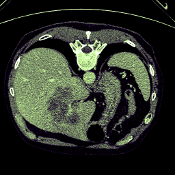</td>
<td>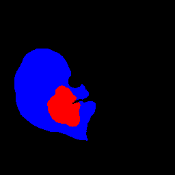</td>
<td></td>
</tr>

<tr>
<td>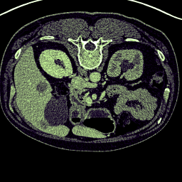</td>
<td></td>
<td>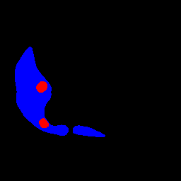</td>
</tr>

<tr>
<td>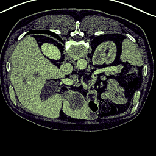</td>
<td></td>
<td>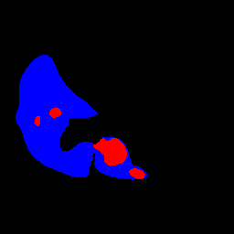</td>
</tr>
</table>

 
<h3>1. Dataset Citation</h3>
The dataset used here was taken from   
<a href="https://www.kaggle.com/datasets/sodko3/lits-dataset-liver-and-tumor-segmentation-256x256">
<b>LiTS Dataset: Liver and Tumor Segmentation 256x256</b>
</a>  
Preprocessed 256x256 PNG images and masks for medical image segmentation tasks. by Sodoo.
  
The following explanation, slightly modified by us, was taken from the above kaggle web site
<a href="https://www.kaggle.com/datasets/sodko3/lits-dataset-liver-and-tumor-segmentation-256x256">
<b>LiTS Dataset: Liver and Tumor Segmentation 256x256</b>
</a>
  
<b>About Dataset</b> 
<b>Overview</b> 
This dataset is specifically curated for medical image segmentation tasks focusing on liver and tumor detection. 
It contains processed CT scan slices converted into a manageable format for deep learning models. The primary goal is to provide a clean dataset for developing and benchmarking segmentation algorithms like U-Net, TransUNet, or other hybrid architectures.
  
<b>Dataset Specifications</b> 
<ul>
<li>Image Resolution: 256x256 pixels.</li>
<li>Format: PNG (lossless compression to maintain medical detail).</li>
<li>Content: Only slices containing the liver or tumor are included to reduce class imbalance 
and focus on relevant anatomical features.</li>
</ul>
<b>Data Structure</b> 
The dataset is organized into three main directories: 
<ul>
<li>Images: Contains the original CT scan slices in grayscale.</li>
<li>Liver_mask: Ground truth masks for the liver region.</li>
<li>Tumor_mask: Ground truth masks for the tumor regions.</li>
<li>
Dataset_df.csv: A metadata file containing file paths and possibly labels for easier data loading and batch processing.
</li>
</ul>
<b>Source & Preprocessing</b> 
The data is derived from the LiTS (Liver Tumor Segmentation Challenge) dataset. Preprocessing steps included: 
<ul>
<li>Windowing/Hounsfield Unit (HU) clipping to enhance soft tissue visibility.
</li>
<li>
Resizing from original dimensions to 256x256.
</li>
<li>
Normalization of pixel intensities.
</li>
</ul>
<b>License</b> 
<a href="https://creativecommons.org/licenses/by-nc-sa/4.0/">
CC BY-NC-SA 4.0
</a>
 
 
<h3>
2 LiTS-Liver-Tumor ImageMask Dataset
</h3>
<h3>2.1 Download ImageMask Dataset</h3>
 If you would like to train this LiTS-Liver-Tumor Segmentation model by yourself,
 please download the dataset from the google drive  
 <a href="https://drive.google.com/file/d/1Je31xpTgPTe60p13zvhPqvheGhYrji9Q/view?usp=sharing">
LiTS-Liver-Tumor-ImageMask-Dataset.zip</a> (<a href="https://creativecommons.org/licenses/by-nc-sa/4.0/">
CC BY-NC-SA 4.0</a>)
, expand the downloaded ImageMaskDataset and put it under <b>./dataset</b> folder to be
 
<pre>
./dataset
└─LiTS-Liver-Tumor
    ├─test
    │   ├─images
    │   └─masks
    ├─train
    │   ├─images
    │   └─masks
    └─valid
        ├─images
        └─masks
</pre>
 
<b>LiTS-Liver-Tumor Statistics</b> 
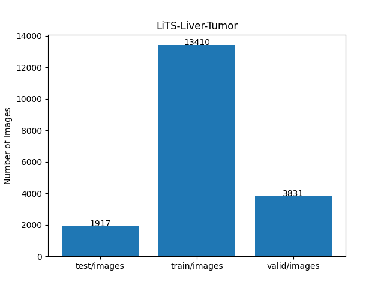 
 
As shown above, the number of images of train and valid datasets is large enough to use for the
 training set of our segmentation model.
 
 
<h3>2.2 Derivation of LiTS-Liver-Tumor with colorized masks</h3>
The folder structure of the original dataset is the following.
The mask data was split into two folders (Liver_mask and Tumor_mask).  
<pre>
./archaive
└─Thesis_data
    ├─Images
    │   ├─volume-0_0.png
...
    │   └─volume-130_623.png
    ├─Liver_mask
    │   ├─ilivermask-0_0.png
...
    │   └─livermask-130_623.png
    └─Tumor_mask
        ├─tumormask-0_0.png
...
        └─tumormask-130_623.png

</pre>
<b>Step 1</b> 
We generated  colorized masks dataset 
(<b>Liver:blue, Tumor: red</b>) from the the original Liver and Tumor masks 
by combining each Liver mask with the corresponding Tumor mask into one colorized mask. 
  
<b>Step 2</b> 
We generated  our multiclass ImageMask dataset from all pairs of the image and 
the colorize mask. However, for simplicity. we excluded all black empty masks and their corresponding images,
which are irrelevant to train our segmentation model.
  
<h3>
2.3 Train sample images and masks
</h3>
<b>Train sample images</b> 
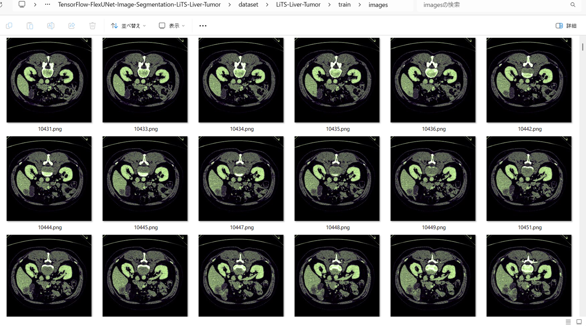
 
<b>Train_sample masks</b> 
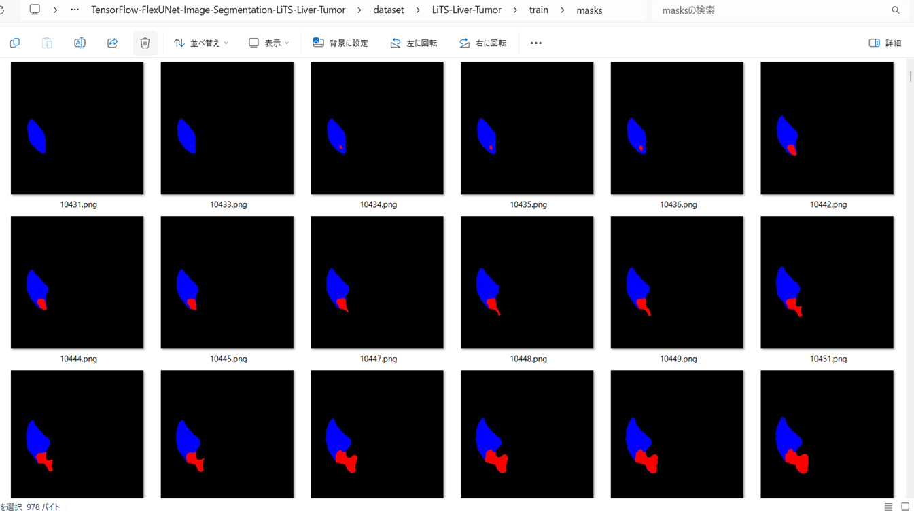
 

<h3>
3 Train TensorFlowFlexUNet Model
</h3>
 We trained LiTS-Liver-Tumor TensorFlowFlexUNet Model by using the 
<a href="./projects/TensorFlowFlexUNet/LiTS-Liver-Tumor/train_eval_infer.config"> <b>train_eval_infer.config</b></a> file.  
Please move to ./projects/TensorFlowFlexUNet/LiTS-Liver-Tumor and run the following bat file. 
<pre>
>1.train.bat
</pre>
, which simply runs the following command. 
<pre>
>python ../../../src/TensorFlowFlexUNetTrainer.py ./train_eval_infer.config
</pre>

<b>Model parameters</b> 
Defined a small <b>base_filters = 16 </b> and large <b>base_kernels = (11,11)</b> for the first Conv Layer of Encoder Block of 
<a href="./src/TensorFlowFlexUNet.py">TensorFlowFlexUNet.py</a> 
and a large <b>num_layers=8</b> (including a bridge between Encoder and Decoder Blocks).
<pre>
[model]
;You may specify your own UNet class derived from our TensorFlowFlexModel
model         = "TensorFlowFlexUNet"
image_width    = 512
image_height   = 512
image_channels = 3
input_normalize = True
normalization  = False
num_classes    = 3
base_filters   = 16
base_kernels   = (11,11)
num_layers     = 8
dropout_rate   = 0.05
dilation       = (1,1)
</pre>
<b>Learning rate</b> 
Defined a small learning rate.  
<pre>
[model]
learning_rate  = 0.00007
</pre>
<b>Loss and metrics functions</b> 
Specified "categorical_crossentropy" and <a href="./src/dice_coef_multiclass.py">"dice_coef_multiclass"</a>. 
<pre>
[model]
loss           = "categorical_crossentropy"
metrics        = ["dice_coef_multiclass"]
</pre>
<b>Dataset class</b> 
Specifed <a href="./src/ImageCategorizedMaskDataset.py">ImageCategorizedMaskDataset</a> class. 
<pre>
[dataset]
class_name    = "ImageCategorizedMaskDataset"
</pre>
 
<b>Learning rate reducer callback</b> 
Enabled learing_rate_reducer callback, and a small reducer_patience.
<pre> 
[train]
learning_rate_reducer = True
reducer_factor     = 0.4
reducer_patience   = 4
</pre>
<b>Early stopping callback</b> 
Enabled early stopping callback with patience parameter.
<pre>
[train]
patience      = 10
</pre>
<b>RGB Color map</b> 
Specifed rgb color map dict for LiTS-Liver-Tumor 1+3 classes. 
<pre>
[mask]
mask_datatyoe    = "categorized"
mask_file_format = ".png"
;LiTS-Liver-Tumor rgb color map dict for 1+2 classes.
;                     Liver:blue, Tumor:red
rgb_map = {(0,0,0):0, (0, 0, 255):1, (255,0,0):2 }

</pre>
<b>Epoch change inference callback</b> 
Enabled <a href="./src/EpochChangeInferencer.py">epoch_change_infer callback</a></b>. 
<pre>
[train]
epoch_change_infer       = True
epoch_change_infer_dir   =  "./epoch_change_infer"
num_infer_images         = 6
</pre>
By using this callback, on every epoch_change, the inference procedure can be called
 for 6 images in <b>mini_test</b> folder. This will help you confirm how the predicted mask changes 
 at each epoch during your training process.  
  
As shown below, early in the model training, the predicted masks from our UNet segmentation model showed 
discouraging results.
 However, as training progressed through the epochs, the predictions gradually improved. 
   
 
<b>Epoch_change_inference output at starting (epoch 1,2,3)</b> 
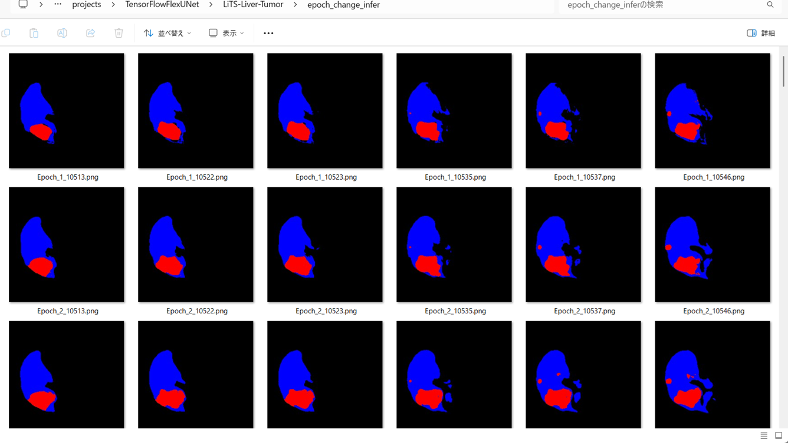 
 
<b>Epoch_change_inference output at middlepoint (epoch 18,19,20)</b> 
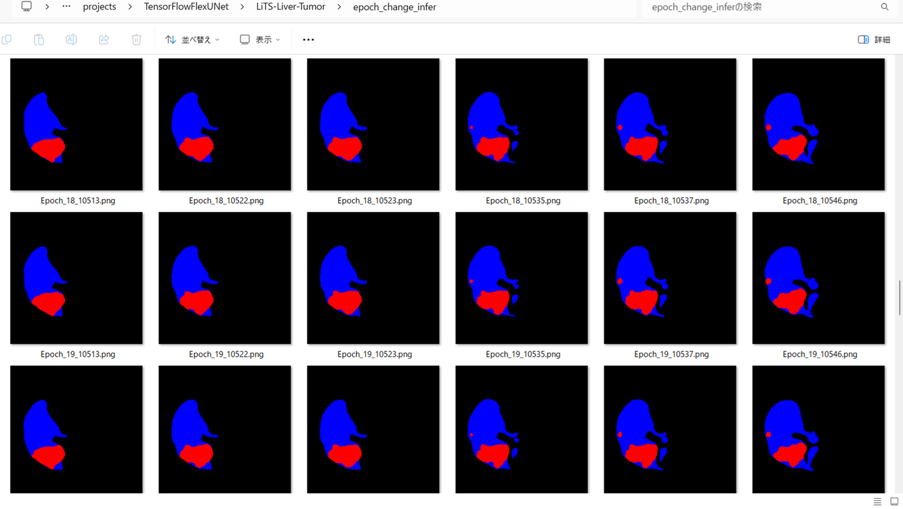 
 
<b>Epoch_change_inference output at ending (epoch 38,39,40)</b> 
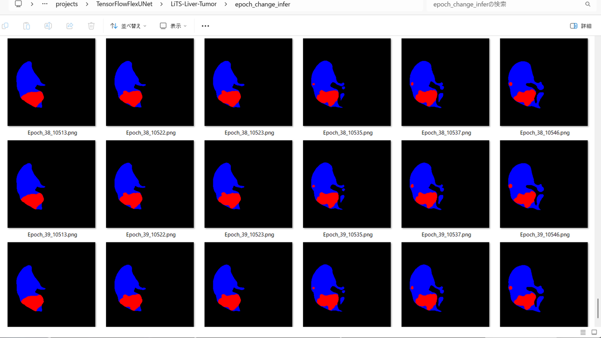 
 
In this experiment, the training process was stopped at epoch 40 by EarlyStopping callback.  
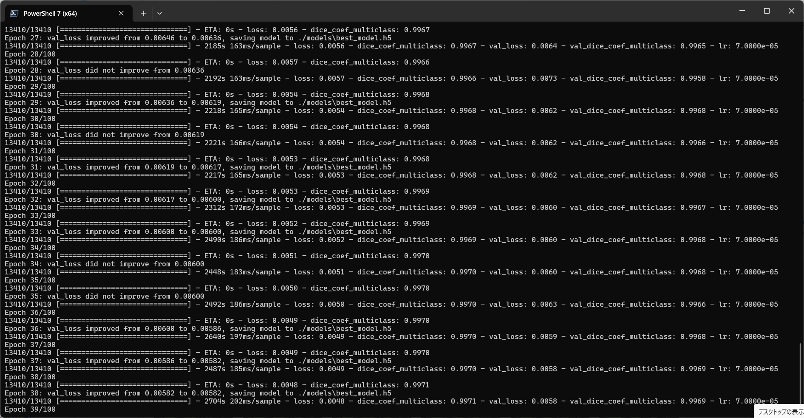 
 
<a href="./projects/TensorFlowFlexUNet/LiTS-Liver-Tumor/eval/train_metrics.csv">train_metrics.csv</a> 
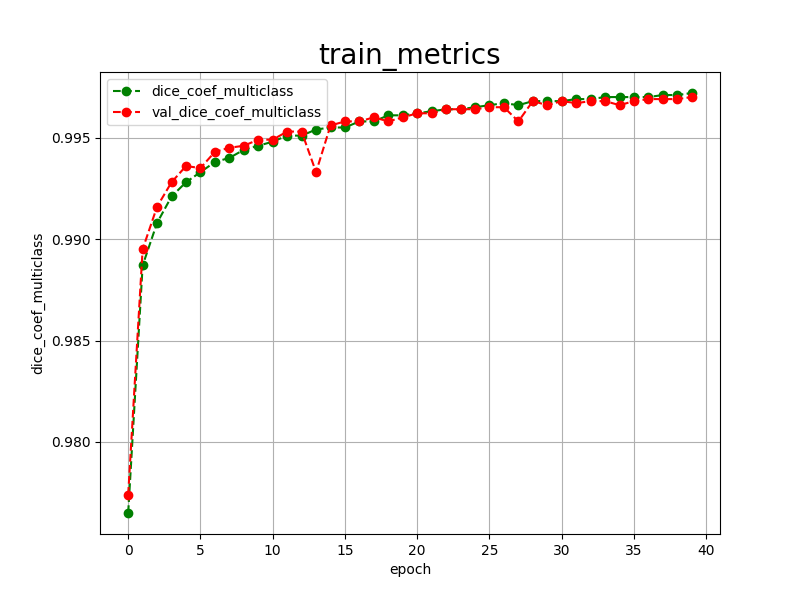 
 
<a href="./projects/TensorFlowFlexUNet/LiTS-Liver-Tumor/eval/train_losses.csv">train_losses.csv</a> 
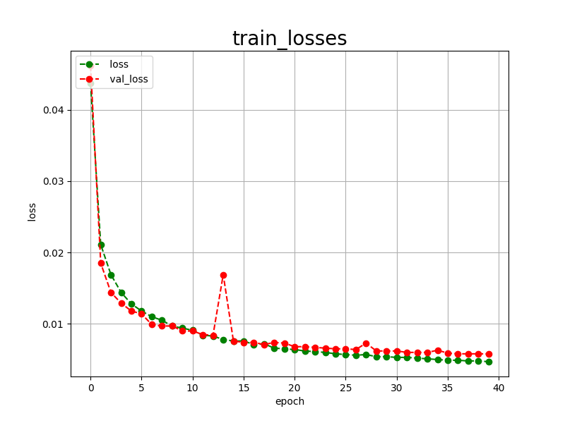 
 
<h3>
4 Evaluation
</h3>
Please move to <b>./projects/TensorFlowFlexUNet/LiTS-Liver-Tumor</b> folder, 
and run the following bat file to evaluate TensorFlowUNet model for LiTS-Liver-Tumor. 
<pre>
./2.evaluate.bat
</pre>
This bat file simply runs the following command.
<pre>
python ../../../src/TensorFlowFlexUNetEvaluator.py ./train_eval_infer_aug.config
</pre>
Evaluation console output: 
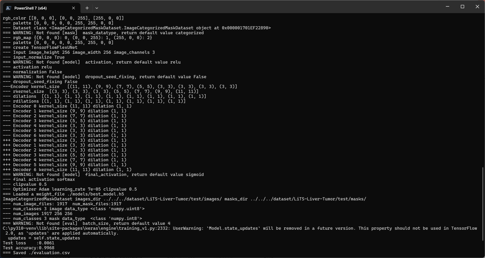
  Image-Segmentation-LiTS-Liver-Tumor
<a href="./projects/TensorFlowFlexUNet/LiTS-Liver-Tumor/evaluation.csv">evaluation.csv</a> 
The loss (categorical_crossentropy) to this <b>LiTS-Liver-Tumor/test</b> was very low and dice_coef_multiclass 
very high as shown below.
 
<pre>
categorical_crossentropy,0.0061
dice_coef_multiclass,0.9968
</pre>
 
<h3>
5 Inference
</h3>
Please move to a <b>./projects/TensorFlowFlexUNet/LiTS-Liver-Tumor</b> folder 
,and run the following bat file to infer segmentation regions for images by the Trained-TensorFlowUNet model for LiTS-Liver-Tumor. 
<pre>
./3.infer.bat
</pre>
This simply runs the following command.
<pre>
python ../../../src/TensorFlowFlexUNetInferencer.py ./train_eval_infer_aug.config
</pre>

<b>mini_test_images</b> 
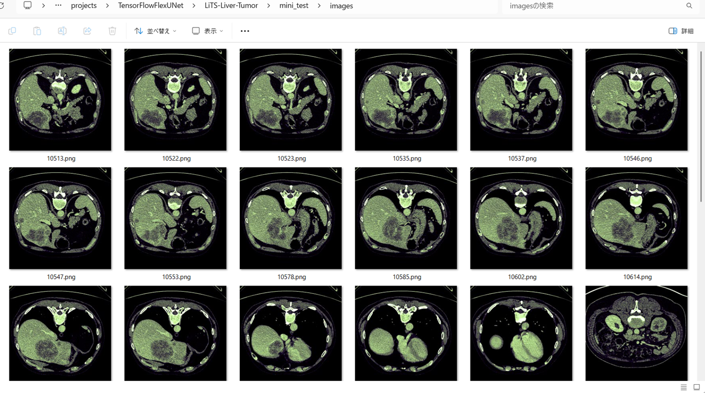 
<b>mini_test_mask(ground_truth)</b> 
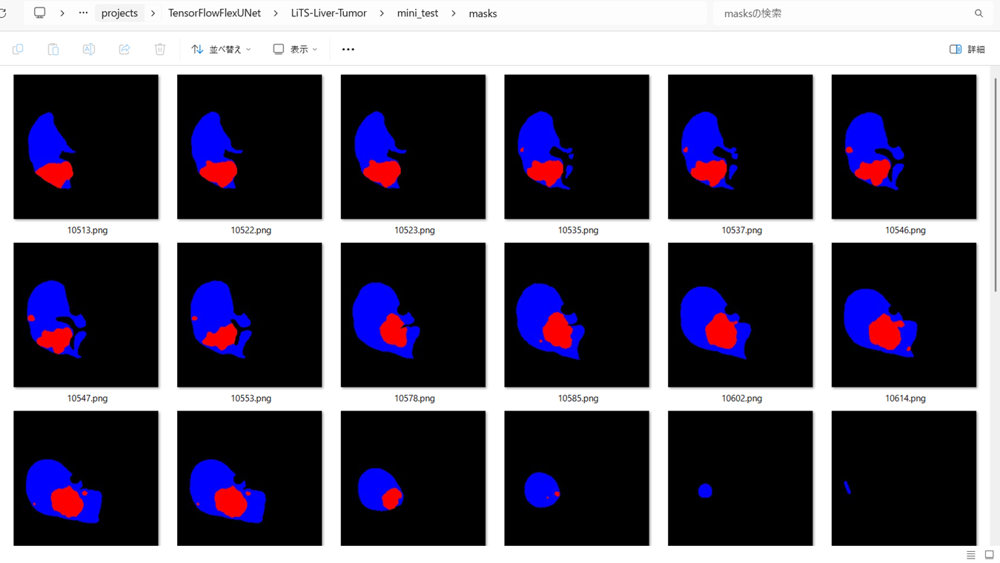 

<b>Inferred test masks</b> 
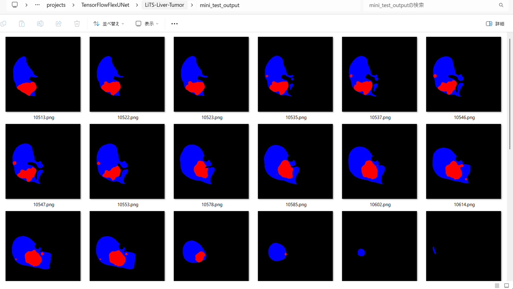 
 

<b>Enlarged images and masks of LiTS-Liver-Tumor Images</b> 
As shown below, the inferred masks predicted by our segmentation model trained by the dataset 
appear similar to the ground truth masks.
  
<b>class color map = {Liver: blue, Tumor:red}</b>
  
<table>
<tr>
<th>Image</th>
<th>Mask (ground_truth)</th>
<th>Inferred-mask</th>
</tr>
<tr>
<td>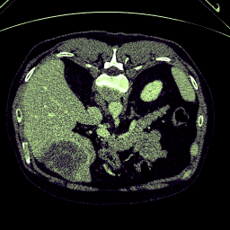</td>
<td>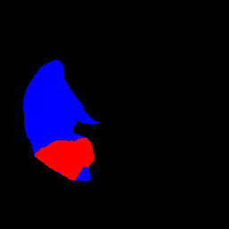</td>
<td></td>
</tr>

<tr>
<td>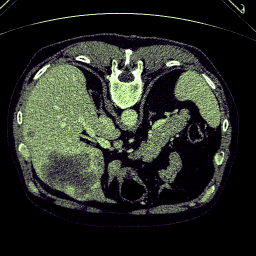</td>
<td></td>
<td>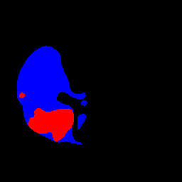</td>
</tr>

<tr>
<td>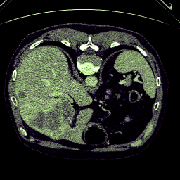</td>
<td>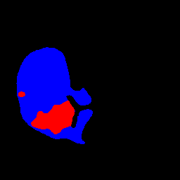</td>
<td>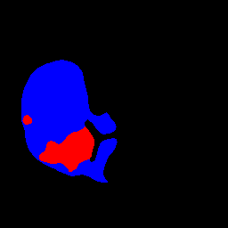</td>
</tr>

<tr>
<td>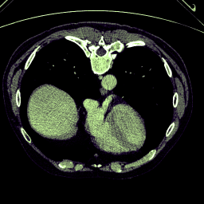</td>
<td>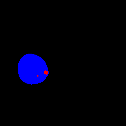</td>
<td></td>
</tr>

<tr>
<td></td>
<td></td>
<td></td>
</tr>

<tr>
<td>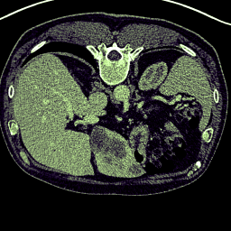</td>
<td></td>
<td>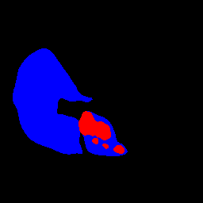</td>
</tr>
</table>

 
<h3>
References
</h3>
<b>1. TensorFlow-FlexUNet-Image-Segmentation-3D-CT-Kidney-Tumor</b> 
Toshiyuki Arai 
<a href="https://github.com/sarah-antillia/TensorFlow-FlexUNet-Image-Segmentation-3D-CT-Kidney-Tumor">
https://github.com/sarah-antillia/TensorFlow-FlexUNet-Image-Segmentation-3D-CT-Kidney-Tumor</a>
  
<b>2. TensorFlow-FlexUNet-Image-Segmentation-3D-Liver-Tumor</b> 
Toshiyuki Arai 
<a href="https://github.com/sarah-antillia/TensorFlow-FlexUNet-Image-Segmentation-3D-Liver-Tumor">
https://github.com/sarah-antillia/TensorFlow-FlexUNet-Image-Segmentation-3D-Liver-Tumor</a>
  
<b>3. TensorFlow-FlexUNet-Image-Segmentation-Ultrasound-Liver</b> 
Toshiyuki Arai 
<a href="https://github.com/sarah-antillia/TensorFlow-FlexUNet-Image-Segmentation-Ultrasound-Liver">
https://github.com/sarah-antillia/TensorFlow-FlexUNet-Image-Segmentation-Ultrasound-Liver</a>
  
<b>4. TensorFlow-FlexUNet-Image-Segmentation-KiTS19-Kidney-Tumor</b> 
Toshiyuki Arai 
<a href="https://github.com/sarah-antillia/TensorFlow-FlexUNet-Image-Segmentation-KiTS19-Kidney-Tumor">
https://github.com/sarah-antillia/TensorFlow-FlexUNet-Image-Segmentation-KiTS19-Kidney-Tumor</a>
  
<b>5. TensorFlow-FlexUNet-Image-Segmentation-Model</b> 
Toshiyuki Arai antillia.com 
<a href="https://github.com/sarah-antillia/TensorFlow-FlexUNet-Image-Segmentation-Model">
https://github.com/sarah-antillia/TensorFlow-FlexUNet-Image-Segmentation-Model</a>
  

